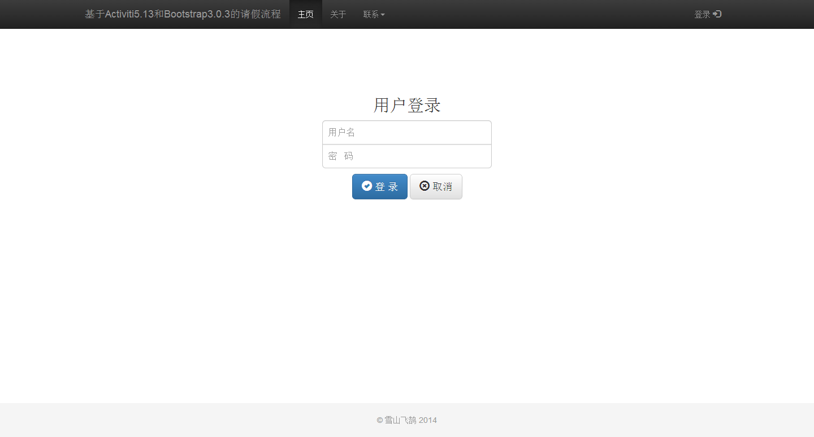
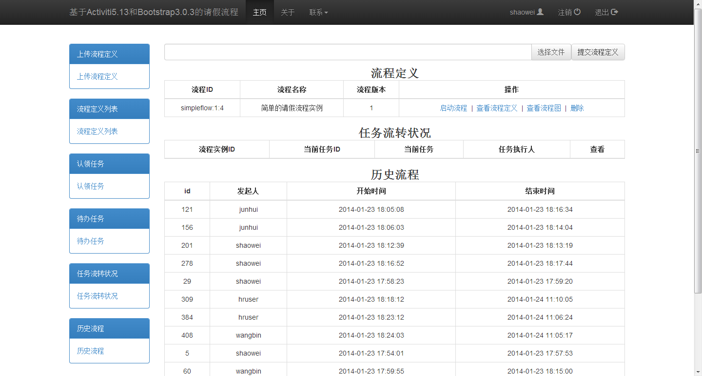

一个基于Activiti5.13和Bootstrap3.0.3的请假流程

本项目修改于https://github.com/burgleaf/activiti-demo

运行环境

1. 数据库：MySQL 5.5
2. Web 服务器：Tomcat 7.0

使用方法

1. 修改 src/main/resources/application.properties 文件，指定数据库相关信息。
2. 在 MySQL 中创建数据库。
3. 执行 src/main/sql/groupuser.sql 脚本。
4. 配置 Tomcat，并运行该应用。
5. 可参照http://www.burgleaf.com/archives/207 

